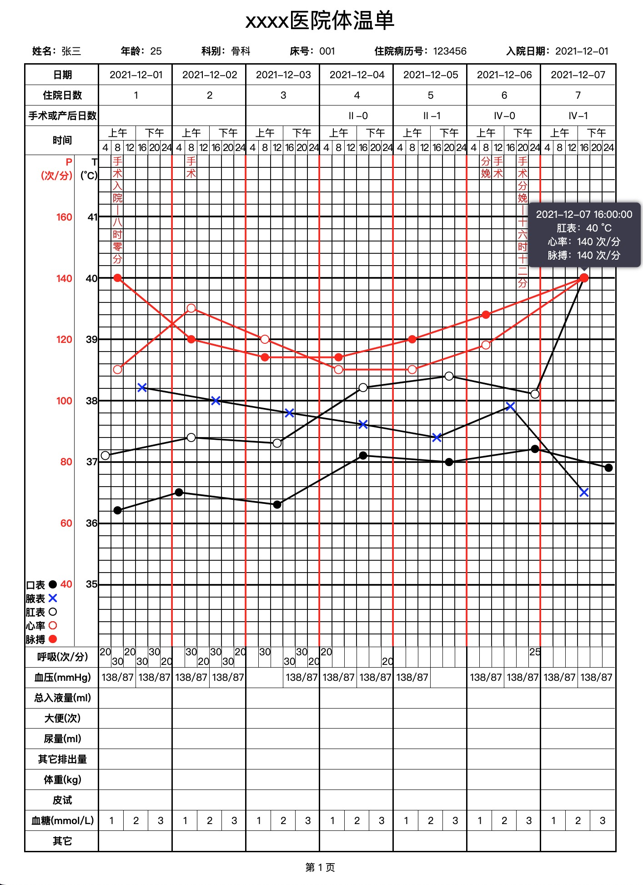

## Temperature chart
### 预览：[在线预览](https://centuryeggs.github.io/temperature-chart/)


### 使用：
```
<link rel="stylesheet" href="style.css">
<script src="temperatureChart.js"></script>
<div id="A4"></div>
<script>
  const el = document.getElementById('A4')
  const originData = {
    /* ↓ 标题 */
    title: 'xxxx医院体温单',
    /* ↓ 基本信息，注：宽度超出一行会自动换 */
    baseInfo: [
      { label: '姓名', value: '张三' },
      { label: '年龄', value: '25' },
      { label: '科别', value: '骨科' },
      { label: '床号', value: '001' },
      { label: '住院病历号', value: '123456' },
      { label: '入院日期', value: '2021-12-01' }
    ],
    /*  ↓ 头部表格数据,
        注：数组中每一个元素表示一行；
        tableHeadData[0]['日期'][0]是第一天日期，
        当天的 00:00:00 x轴的原点 */
    tableHeadData: [
      { '日期': ['2021-12-01', '2021-12-02', '2021-12-03', '2021-12-04', '2021-12-05', '2021-12-06', '2021-12-07'] },
      { '住院日数': ['1', '2', '3', '4', '5', '6', '7'] },
      { '手术或产后日数': ['', '', '', 'Ⅱ-0', 'Ⅱ-1', 'Ⅳ-0', 'Ⅳ-1'] }
    ],
    /* ↓ 底部表格数据，注：数组中每一个元素表示一行 */
    tableFootData: [
      { '呼吸(次/分)': [
        [20,30,20,30,30,20],
        ['',30,20,30,30,20],
        ['',30,'',30,30,20],
        [20,'','','','',20],
        ['','','','','',''],
        ['','','','','',25],
        ['','','','','','']
      ]},
      { '血压(mmHg)': [
        ['138/87', '138/87'],
        ['138/87', '138/87'],
        ['', '138/87'],
        ['138/87', '138/87'],
        ['138/87', ''],
        ['138/87', '138/87'],
        ['138/87', '138/87']
      ] },
      { '总入液量(ml)': ['', '', '', '', '', '', ''] },
      { '大便(次)': ['', '', '', '', '', '', ''] },
      { '尿量(ml)': ['', '', '', '', '', '', ''] },
      { '其它排出量': ['', '', '', '', '', '', ''] },
      { '体重(kg)': ['', '', '', '', '', '', ''] },
      { '皮试': ['', '', '', '', '', '', ''] },
      { '血糖(mmol/L)': [[1,2,3], [1,2,3], [1,2,3], [1,2,3], [1,2,3], [1,2,3], [1,2,3]] },
      { '其它': ['', '', '', '', '', '', ''] }
    ],
    /* ↓ 口表温度数据，每个元素表示数据点的 [x,y] */
    mouthTemperature: [
      ['2021-12-01 04:00:01',36.2],
      ['2021-12-02 00:00:00',36.5],
      ['2021-12-03 12:00:00',36.3],
      ['2021-12-04 16:00:00',37.1],
      ['2021-12-05 20:00:00',37],
      ['2021-12-06 23:59:59',37.2],
      ['2021-12-07 24:00:00',36.9]
    ],
    /* ↓ 腋表温度数据，每个元素表示数据点的 [x,y] */
    armpitTemperature: [
      ['2021-12-01 16:00:00',38.2],
      ['2021-12-02 16:00:00',38],
      ['2021-12-03 16:00:00',37.8],
      ['2021-12-04 16:00:00',37.6],
      ['2021-12-05 16:00:00',37.4],
      ['2021-12-06 16:00:00',37.9],
      ['2021-12-07 16:00:00',36.5]
    ],
    /* ↓ 肛表温度数据，每个元素表示数据点的 [x,y] */
    anusTemperature: [
      ['2021-12-01 04:00:00',37.1],
      ['2021-12-02 08:00:00',37.4],
      ['2021-12-03 12:00:00',37.3],
      ['2021-12-04 16:00:00',38.2],
      ['2021-12-05 20:00:00',38.4],
      ['2021-12-06 24:00:00',38.1],
      ['2021-12-07 16:00:00',40]
    ],
    /* ↓ 脉搏数据，每个元素表示数据点的 [x,y]*/
    pulseFrequency: [
      ['2021-12-01 08:00:00',140],
      ['2021-12-02 08:00:00',120],
      ['2021-12-03 08:00:00',114],
      ['2021-12-04 08:00:00',114],
      ['2021-12-05 08:00:00',120],
      ['2021-12-06 08:00:00',128],
      ['2021-12-07 16:00:00',140]
    ],
    /* ↓ 心率数据，每个元素表示数据点的 [x,y] */
    heartFrequency: [
      ['2021-12-01 08:00:00',110],
      ['2021-12-02 08:00:00',130],
      ['2021-12-03 08:00:00',120],
      ['2021-12-04 08:00:00',110],
      ['2021-12-05 08:00:00',110],
      ['2021-12-06 08:00:00',118],
      ['2021-12-07 16:00:00',140]
    ],
    /* ↓ 其它文字注释，[x轴对应时间, 文字内容] */
    textRemarks: [
      ['2021-12-01 08:00:00', '手术入院—八时零分'],
      ['2021-12-02 08:00:00', '手术'],
      ['2021-12-06 08:00:00', '分娩'],
      ['2021-12-06 12:00:00', '手术'],
      ['2021-12-06 16:12:00', '手术分娩—十六时十二分']
    ]
  }
  const chart = new TemperatureChart(el, originData)
</script>
```
### 功能：
|   | 描述 | 状态 |
|---|-------|-------|
| 1 | hover显示坐标信息 | 完成 |
| 2 | 底部table若入参类型为数组，则根据数组length自动均分单元格 | 完成 |
| 3 | 呼吸行上下错开显示（且每天首次显示在格子上部） | 完成 |
| 4 | 不同折线的点重合时，合并坐标信息 | 完成 |
| 5 | 点击左下角图示，控制对应折线的显示隐藏 | 完成 |
| 6 | 通过update方法，局部更新表格内容 | 未完成 |
