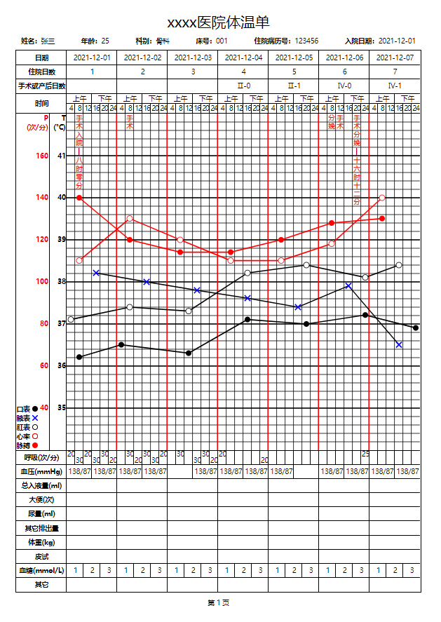

## Temperature chart
### 预览：[在线预览](https://centuryeggs.github.io/temperature-chart/)


### 使用：
```
// 下载drawSvg.js并引入
<div id="A4"></div>
<script src="./drawSvg.js"></script>
<script>
  const el = document.getElementsById('A4');
  const originData = {
    title: ...,
    baseInfo: ...,
    tableHeadData: ...,
    tableFootData: ...,
    ...
  }
  new TemperatureChart(el, originData)
</script>
```
